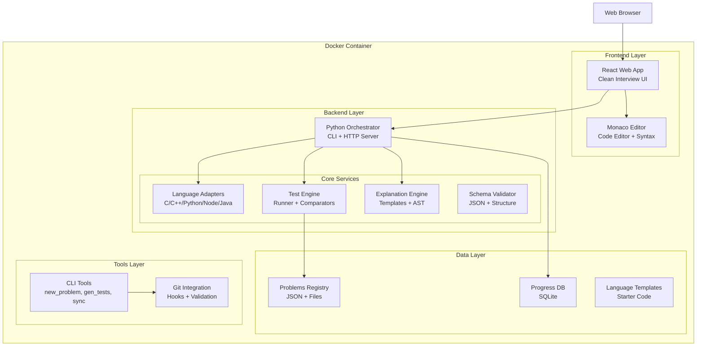
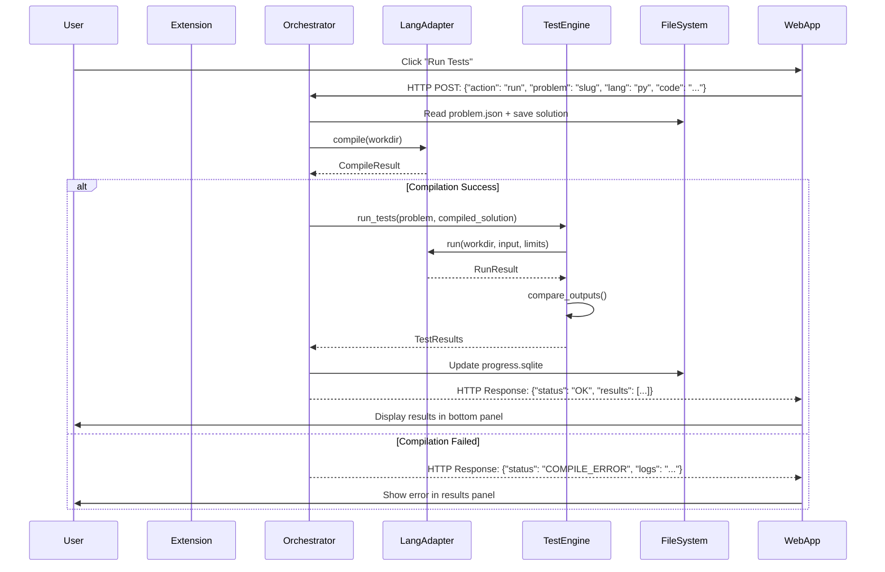

# Design Document

## Overview

The Interview Coding Platform is an offline-first, containerized development environment that provides a clean coding interview practice experience. The system consists of three main components: a React web application with Monaco Editor for the user interface, a Python orchestrator for backend processing, and a Docker container that encapsulates the entire environment.

The architecture follows a client-server pattern where the React frontend communicates with the Python orchestrator via HTTP API calls. All components run within a single Docker container to ensure complete offline functionality and consistent behavior across different host systems. The UI is designed to be clean and focused, similar to popular coding interview platforms, without the complexity of a full IDE.

## Architecture

### High-Level Architecture



### Component Interaction Flow



## Components and Interfaces

### React Web Application

**Purpose**: Provides a clean, focused user interface for coding interview practice with minimal distractions.

**Key Components**:

- **Problem List Panel**: Scrollable list of problems organized by difficulty and tags
- **Problem Description Panel**: Displays problem statement, examples, and constraints
- **Monaco Editor**: Code editor with syntax highlighting and language-specific features
- **Control Bar**: Run, Debug, language selector, and other action buttons
- **Results Panel**: Test case results, execution metrics, and error messages

**UI Layout**:

```
┌─────────────────┬─────────────────────────────────┐
│   Problem List  │         Monaco Editor           │
│                 │                                 │
│ • Two Sum       │  def solve(nums, target):       │
│ • Add Two Nums  │      # Your solution here       │
│ • ...           │      return []                  │
│                 │                                 │
│ Problem Desc:   │  [Run] [Debug] [C++▼] [Explain] │
│ Given array...  ├─────────────────────────────────┤
│                 │        Test Results             │
│ Examples:       │  ✓ Case 1: [2,7] target=9      │
│ Input: [2,7,11] │  ✗ Case 2: Expected [0,1]      │
│ Output: [0,1]   │    Got: [1,0]                   │
└─────────────────┴─────────────────────────────────┘
```

**HTTP API Interface**:

```typescript
interface RunRequest {
  action: "run" | "explain" | "gen-tests";
  problem: string;
  lang: string;
  code: string;
  tests?: "sample" | "unit" | "all";
}

interface RunResponse {
  status: "OK" | "COMPILE_ERROR" | "RUNTIME_ERROR" | "TIMEOUT" | "MLE" | "WA";
  summary?: TestSummary;
  cases?: TestCase[];
  logs?: CompilationLogs;
  explanation?: string;
}
```

### Python Orchestrator

**Purpose**: Central coordination service that manages all backend operations including compilation, execution, testing, and explanation generation.

**Architecture**:

```python
class Orchestrator:
    def __init__(self):
        self.language_adapters = self._load_adapters()
        self.test_engine = TestEngine()
        self.explain_engine = ExplainEngine()
        self.validator = SchemaValidator()
        self.progress_db = ProgressDB()

    def handle_command(self, command: dict) -> dict:
        # Route commands to appropriate handlers
        pass
```

**Key Responsibilities**:

- Command routing and validation
- Resource limit enforcement coordination
- Progress tracking and persistence
- Error handling and logging
- JSON schema validation

### Language Adapters

**Purpose**: Provide language-specific compilation and execution capabilities with consistent interfaces.

**Base Interface**:

```python
class LanguageAdapter(ABC):
    name: str
    entry_file: str
    runtime_cmd: List[str]

    @abstractmethod
    def compile(self, workdir: Path) -> CompileResult:
        """Compile source code and return result with logs"""
        pass

    @abstractmethod
    def run(self, workdir: Path, stdin_path: Path,
            stdout_path: Path, limits: ResourceLimits) -> RunResult:
        """Execute compiled code with resource limits"""
        pass
```

**Language-Specific Implementations**:

- **C Adapter**: Uses `gcc -O2 -std=c17`, enforces POSIX compliance
- **C++ Adapter**: Uses `g++ -O2 -std=c++17`, includes `<bits/stdc++.h>` support
- **Python Adapter**: Uses `python3` with `PYTHONHASHSEED=0` for determinism
- **Node.js Adapter**: Uses `node` with `--max-old-space-size` for memory limits
- **Java Adapter**: Uses `javac` + `java -Xmx` for compilation and execution

### Test Engine

**Purpose**: Executes test cases against solutions and provides detailed result analysis.

**Core Components**:

```python
class TestEngine:
    def __init__(self):
        self.comparators = {
            'text_exact': TextExactComparator(),
            'numeric': NumericComparator(),
            'json': JsonComparator()
        }
        self.generators = self._load_generators()

    def run_tests(self, problem: Problem, solution_path: Path,
                  test_set: str) -> TestResults:
        # Execute tests with proper isolation and limits
        pass
```

**Test Comparators**:

- **TextExactComparator**: Byte-for-byte comparison with whitespace normalization
- **NumericComparator**: Floating-point comparison with configurable epsilon tolerance
- **JsonComparator**: Semantic JSON comparison with key sorting and normalization

**Test Generation**:

- Deterministic generators using fixed seeds from problem.json
- Support for constraint-based generation (string lengths, array sizes, etc.)
- Automatic reference solution execution for expected output generation

### Explanation Engine

**Purpose**: Generates educational content about solution approaches using offline templates and community contributions.

**Architecture**:

```python
class ExplainEngine:
    def __init__(self):
        self.templates = self._load_templates()
        self.community_explanations = {}

    def generate_explanation(self, problem: Problem,
                           solution_path: Path) -> str:
        # Priority: community explanation > template-based generation
        pass
```

**Template System**:

- Pattern-based templates (sliding_window, two_pointers, dynamic_programming, etc.)
- Markdown output with sections: Intuition, Algorithm, Complexity, Edge Cases
- Variable substitution from problem metadata and solution analysis

**Community Integration**:

- Support for explanation.md files in problem directories
- Pack-bundled explanations from community contributors
- Fallback to template generation when community content unavailable

## Data Models

### Problem Schema

```json
{
  "schema_version": "1.0.0",
  "slug": "problem-identifier",
  "title": "Human Readable Title",
  "license": "CC-BY-4.0",
  "difficulty": "Easy|Medium|Hard",
  "tags": ["array", "sliding-window", "hash-table"],
  "io": {
    "mode": "stdin-stdout|function",
    "stdin_format": "description for humans",
    "stdout_format": "description for humans",
    "signature": {
      "language_signatures": {
        "cpp": "int solve(const std::string& s)",
        "py": "def solve(s: str) -> int"
      }
    }
  },
  "constraints": [
    { "name": "n", "min": 1, "max": 200000, "desc": "string length" },
    { "name": "charset", "value": "ASCII [0,127]" }
  ],
  "statement_md": "Problem description in markdown",
  "examples": [{ "in": "input\n", "out": "expected_output\n" }],
  "explanation": {
    "pattern": "sliding_window_cover",
    "big_o": { "time": "O(n)", "space": "O(k)" },
    "edge_cases": ["empty input", "single element", "all same"]
  },
  "test_spec": {
    "generator": "strings.cover_all_chars",
    "seeds": [42, 1337, 9001],
    "sets": {
      "small": { "count": 5, "n": [1, 50] },
      "medium": { "count": 5, "n": [1000, 5000] },
      "large": { "count": 3, "n": [100000, 200000] }
    }
  },
  "version": "1.0.0"
}
```

### Progress Database Schema

```sql
CREATE TABLE IF NOT EXISTS attempts (
    id INTEGER PRIMARY KEY,
    slug TEXT NOT NULL,
    lang TEXT NOT NULL,
    timestamp INTEGER NOT NULL,
    status TEXT NOT NULL,  -- OK/WA/RE/TLE/MLE/CE
    time_ms INTEGER,
    mem_mb INTEGER,
    commit_sha TEXT,
    notes TEXT
);

CREATE TABLE IF NOT EXISTS problems_meta (
    slug TEXT PRIMARY KEY,
    first_seen INTEGER,
    difficulty TEXT,
    tags TEXT,  -- comma-separated
    solved_count INTEGER DEFAULT 0,
    last_status TEXT
);

CREATE TABLE IF NOT EXISTS pack_registry (
    pack_name TEXT PRIMARY KEY,
    version TEXT NOT NULL,
    install_date INTEGER NOT NULL,
    source_url TEXT,
    problems_count INTEGER
);
```

### Resource Limits Configuration

```python
@dataclass
class ResourceLimits:
    time_ms: int = 2000          # Wall clock timeout
    cpu_time_ms: int = 2000      # CPU time limit
    memory_mb: int = 256         # Virtual memory limit
    stack_mb: int = 64           # Stack size limit
    file_size_mb: int = 10       # Output file size limit
    open_files: int = 64         # File descriptor limit
    processes: int = 1           # Process count limit
```

## Error Handling

### Error Classification

**Compilation Errors**:

- Syntax errors, missing includes, type mismatches
- Captured from stderr with line numbers when available
- Language-specific error message parsing and formatting

**Runtime Errors**:

- Segmentation faults, null pointer dereferences, exceptions
- Stack overflow, array bounds violations
- Exit code analysis and signal handling

**Resource Limit Violations**:

- Time limit exceeded (TLE): wall clock and CPU time tracking
- Memory limit exceeded (MLE): virtual memory and RSS monitoring
- Output limit exceeded: file size and stdout length limits

**System Errors**:

- File system permissions, disk space issues
- Container resource exhaustion
- Network connectivity problems (for sync operations only)

### Error Recovery Strategies

```python
class ErrorHandler:
    def handle_compilation_error(self, error: CompileError) -> ErrorResponse:
        return ErrorResponse(
            status="COMPILE_ERROR",
            message=self._format_compile_error(error),
            suggestions=self._get_compile_suggestions(error),
            logs=error.stderr
        )

    def handle_runtime_error(self, error: RuntimeError) -> ErrorResponse:
        return ErrorResponse(
            status="RUNTIME_ERROR",
            message=self._format_runtime_error(error),
            exit_code=error.exit_code,
            signal=error.signal,
            logs=error.stderr
        )
```

### Graceful Degradation

- **Offline Mode**: All core functionality works without internet
- **Missing Dependencies**: Clear error messages with installation instructions
- **Corrupted Data**: Automatic schema migration and data repair
- **Resource Constraints**: Automatic limit adjustment based on available resources

## Testing Strategy

### Unit Testing

**Language Adapters**:

- Mock compilation and execution environments
- Test resource limit enforcement
- Verify error handling and logging
- Cross-platform compatibility testing

**Test Engine**:

- Comparator accuracy testing with edge cases
- Generator determinism verification
- Performance benchmarking for large test suites
- Memory leak detection during test execution

**VS Code Extension**:

- UI component rendering tests
- Command handling and error propagation
- Tree view state management
- Panel content formatting

### Integration Testing

**End-to-End Workflows**:

- Complete problem solving workflow from problem selection to result display
- Multi-language solution testing with identical inputs
- Git integration with commit validation and CI pipeline
- Problem pack installation and management

**Docker Container Testing**:

- Container startup and service initialization
- Resource isolation and security boundary testing
- Volume mounting and file permission verification
- Network isolation and offline functionality

### Performance Testing

**Execution Performance**:

- Solution execution time measurement and consistency
- Memory usage profiling under various loads
- Concurrent test execution scalability
- Large problem set handling (1000+ problems)

**Resource Limit Testing**:

- Time limit enforcement accuracy (±50ms tolerance)
- Memory limit detection and process termination
- File descriptor leak prevention
- Process cleanup after execution

### Security Testing

**Code Execution Isolation**:

- Privilege escalation prevention
- File system access restriction testing
- Network access blocking verification
- Resource exhaustion attack prevention

**Input Validation**:

- Malicious input handling in problem definitions
- Code injection prevention in solution files
- Path traversal attack prevention
- JSON schema validation bypass attempts

### Continuous Integration

**Automated Testing Pipeline**:

```yaml
# .github/workflows/ci.yml
name: CI Pipeline
on: [push, pull_request]

jobs:
  validate:
    runs-on: ubuntu-latest
    steps:
      - uses: actions/checkout@v3
      - name: Build Docker Image
        run: docker build -t interview-platform .
      - name: Validate All Problems
        run: docker run --rm interview-platform python3 tools/validate_repo.py
      - name: Run Unit Tests
        run: docker run --rm interview-platform python3 -m pytest orchestrator/tests/
      - name: Test Extension
        run: docker run --rm interview-platform npm test
```

**Quality Gates**:

- All problems must compile and pass sample tests
- Code coverage minimum 80% for core components
- Performance regression detection (execution time increases >20%)
- Security scan with no high-severity vulnerabilities
